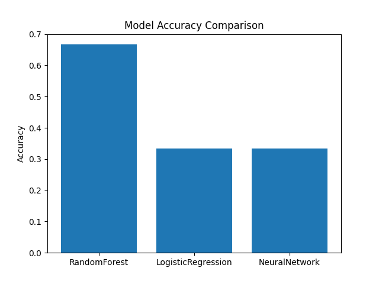

Farmer Case Approval Prediction System
Hybrid Swarm Intelligence Optimization Models
Project Overview

The Farmer Case Approval Prediction System is a machine learning project designed to analyze agricultural case records and predict approval outcomes using hybrid swarm intelligence optimization algorithms.

The system applies bio-inspired optimization techniques such as:

Artificial Immune System (AIS)

Particle Swarm Optimization (PSO)

Bat Algorithm (BA)

Crow Search Algorithm (CSA)

These algorithms are combined into hybrid models to improve prediction accuracy and feature optimization.

The project also generates visual analytics, prediction results, and model artifacts for further analysis and deployment.

Dataset

Dataset File:

Farmer.csv

Dataset Location:

C:\Users\NXTWAVE\Downloads\Farmer Case Approval Prediction System\Farmer.csv
Dataset Features
Feature	Description
Total Cases	Total farmer cases submitted
Eligible	Number of eligible cases
Ineligible	Number of rejected cases
Pending for Inquiry	Cases pending for verification
Target Variable

The system automatically generates a binary target column:

target

Logic used:

target = 1  if Pending for Inquiry > median
target = 0  otherwise
Hybrid Optimization Models Implemented

The project implements multiple hybrid swarm optimization models.

Hybrid Model	Prefix
AIS + CSA	cis_
AIS + PSO	pis_
AIS + BA	bis_
CSA + PSO	psa_
PSO + BA	bso_

Example:

bso_model.pkl

means:

Bat Algorithm + Particle Swarm Optimization
System Workflow

The project follows the pipeline below:

Dataset Loading
        ↓
Data Preprocessing
        ↓
Feature Scaling
        ↓
Hybrid Optimization
        ↓
Model Training
        ↓
Prediction Generation
        ↓
Evaluation Metrics
        ↓
Visualization
        ↓
Result Storage
Machine Learning Components
Feature Scaling
StandardScaler
Classifier
K-Nearest Neighbors (AIS memory style classification)
Evaluation Metrics

Accuracy

Confusion Matrix

Prediction Analysis

Visualizations Generated

The system automatically generates graphs:

Accuracy Graph

Shows model accuracy.

Example file:

bso_accuracy_graph.png
Confusion Matrix Heatmap

Displays classification performance.

bso_confusion_matrix_heatmap.png
Prediction Trend Graph

Shows predicted outcomes across dataset records.

bso_prediction_graph.png
Model Comparison Graph

Shows accuracy comparison between hybrid models.

comparison_graph.png
Files Generated

The system automatically saves results in multiple formats.

Model File
bso_model.pkl

Saved using:

joblib
Result CSV

Contains prediction results for test dataset.

bso_results.csv

Example:

Actual	Prediction
0	0
1	1
Full Dataset Prediction
bso_predictions.csv

Example:

Total Cases	Eligible	Ineligible	Pending	Prediction
Configuration File
bso_config.yaml

Contains model settings and features.

Example:

algorithm: Hybrid PSO + BA
features:
 - Total Cases
 - Eligible
 - Ineligible
 - Pending for Inquiry
target: target
Metadata File
bso_metadata.json

Example:

{
  "rows": 100,
  "accuracy": 0.91,
  "model": "PSO + BA Hybrid"
}
Project Structure
Farmer Case Approval Prediction System
│
├── Farmer.csv
│
├── bso_hybrid_model.py
│
├── models
│
├── results
│
├── graphs
│
├── configs
│
├── metadata
│
└── README.md
Installation

Install required Python libraries.

pip install pandas numpy scikit-learn matplotlib seaborn pyyaml joblib
Running the Project

Run the hybrid model script:

python bso_hybrid_model.py

Output files will automatically be saved in:

C:\Users\NXTWAVE\Downloads\Farmer Case Approval Prediction System
Output Example

After execution the folder will contain:

bso_model.pkl

bso_accuracy_graph.png
bso_confusion_matrix_heatmap.png
bso_prediction_graph.png

bso_predictions.csv
bso_results.csv

bso_config.yaml
bso_metadata.json
Applications

This system can be used for:

Government agricultural scheme analysis

Farmer application screening

Rural infrastructure decision support

Agricultural data analytics

Policy impact evaluation

Future Improvements

Possible extensions include:

Deep Learning Models

Explainable AI (SHAP / LIME)

Real-time farmer data pipelines

Web dashboard visualization

GIS-based agricultural mapping

Author
Sagnik Patra
